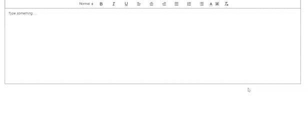

# Vue-Ck-Editor

An easy-to-use but yet powerful and customizable rich text editor powered by Quill.js and Vue.js

## Table of contents

- [Browser Support](#browser-support)
- [Demo](#demo)
- [Getting started](#getting-started)
- [Usage](#usage)
- [Available Props](#available-props)
- [Methods](#methods)
- [Want to Contribute?](#want-to-contribute)
- [Need Help / Support?](#need-help)
- [Collection of Components](#collection-of-components)
- [Changelog](#changelog)
- [Credits](#credits)
- [License](#license)
- [Keywords](#Keywords)

## Browser Support

 |  |  |  |  |
--- | --- | --- | --- | --- | --- |
83.0 ✔ | 77.0  ✔ | 13.1.1 ✔ | 83.0 ✔ | 11.9 ✔ |

## Demo

[](https://github.com/weblineindia/Vue-CK-Editor/editor.gif)

## Getting started

Install the npm package:

``` bash
npm install vue-weblineindia-ck-editor
#OR
yarn add vue-weblineindia-ck-editor
```

## Usage

Use the `<vue-weblineindia-ck-editor>` component:

```vue
<template>
  <div>
  <VueCkEditor v-model="content"/>
  </div>
</template>

<script>
// import vue-weblineindia-ck-editor
import VueCkEditor from 'vue-weblineindia-ck-editor'

export default {
  components: {
    VueCkEditor,
  },
  data() {
    return {
      content: "<h1>Hello from WeblineIndia</h1>"
    };
  }
}
</script>
```

## Available Props

| Name                  | Type    | Default                                              | Description                                                                            |
| --------------------- | ------- | ---------------------------------------------------- | -------------------------------------------------------------------------------------- |
| customModules         | Array   | -                                                    | Declare Quill modules to register                                                      | Use a custom toolbar |
| disabled              | Boolean | false                                                | Set to true to disable editor                                                          |
| editorOptions         | Object  | -                                                    | Offers object for merging into default config (add formats, custom Quill modules, ect) |
| editorToolbar         | Array   | \*\* _Too long for table. See toolbar example below_ | Use a custom toolbar                                                                   |
| id                    | String  | quill-container                                      | Set the id (necessary if multiple editors in the same view)                            |
| placeholder           | String  | -                                                    | Placeholder text for the editor                                                        |
| useCustomImageHandler | Boolean | false                                                | Handle image uploading instead of using default conversion to Base64                   |
| v-model               | String  | -                                                    | Set v-model to the the content or data property you wish to bind it to                 |


## Methods

| Name             | Parameters                   | Description                                                                         |
| ---------------- | ---------------------------- | ----------------------------------------------------------------------------------- |
| blur             | quill                        | Emitted on `blur` event                                                             |
| focus            | quill                        | Emitted on `focus` event                                                            |
| image-added      | file, Editor, cursorLocation | Emitted when `useCustomImageHandler` is true and photo is being added to the editor |
| image-removed    | file, Editor, cursorLocation | Emitted when `useCustomImageHandler` is true and photo has been deleted             |
| selection-change | range, oldRange, source      | Emitted on Quill's `selection-change` event                                         |
| text-change      | delta, oldDelta, source      | Emitted on Quill's `text-change` event

## Want to Contribute?

- Created something awesome, made this code better, added some functionality, or whatever (this is the hardest part).
- [Fork it](http://help.github.com/forking/).
- Create new branch to contribute your changes.
- Commit all your changes to your branch.
- Submit a [pull request](http://help.github.com/pull-requests/).

-----

## Need Help? 

We also provide a free, basic support for all users who want to use this VueJS Ck Editor in their software project. In case you want to customize this Ck Editor to suit your development needs, then feel free to contact our [VueJS developers](https://www.weblineindia.com/hire-vuejs-developer.html).

-----

## Collection of Components
We have built many other components and free resources for software development in various programming languages. Kindly click here to view our [Free Resources for Software Development](https://www.weblineindia.com/communities.html)

------

## Changelog

Detailed changes for each release are documented in [CHANGELOG.md](./CHANGELOG.md).

## Credits

vue-weblineindia-ck-editor is inspired by [vue2-editor](https://github.com/davidroyer/vue2-editor).

## License

[MIT](LICENSE)

[mit]: https://github.com/weblineindia/Vue-CK-Editor/blob/master/LICENSE

## Keywords

vue-weblineindia-ck-editor,rich text,editor,ckeditor,vue components,vuejs,vuejs component
